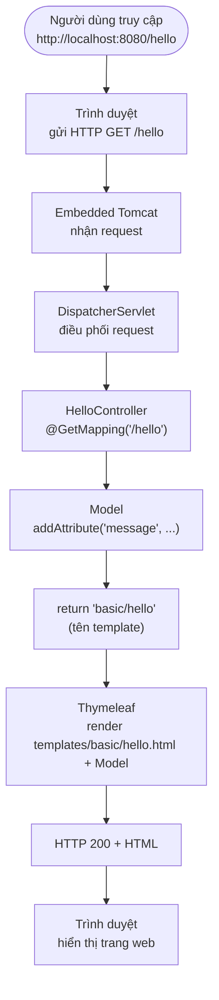

# Bài 4: Spring Boot cơ bản — Làm quen framework và xây dựng trang web với Thymeleaf

### Bài học tham khảo
- [Bài 4: Spring Boot cơ bản — Làm quen framework và xây dựng trang web với Thymeleaf — Github module 2](https://github.com/nguyenvudangkhoa189/t3h-ltv-java-module-2/blob/dev/syllabus/module-2/java_m2_bai4_SpringBoot.md)

## Mục tiêu bài học

Sau bài này, học viên có thể:

- Giải thích Spring Boot là gì và khác Spring Framework ở điểm nào
- Tạo project trên [start.spring.io](https://start.spring.io/), mở bằng IntelliJ và chạy ứng dụng
- Đọc được cấu trúc thư mục, `pom.xml`, `application.properties`
- Viết controller + trang Thymeleaf Hello World
- Phân biệt hai cách render Thymeleaf (`@Controller` vs `SpringTemplateEngine`) và biết chọn cách phù hợp

## Điều kiện tiên quyết

- Đã hoàn thành **Bài 3**: mô hình MVC — Model, View, Controller, Service, luồng request/response ([java_m2_lesson3_MVC.md](https://github.com/HoangKim1504/java-course-module-2/blob/main/syllabus/module-2/java_m2_lesson3_MVC_note.md))
- Biết Java cơ bản: class, package, annotation cơ bản
- Đã học HTML (cấu trúc trang web) — hiểu trình duyệt gửi request và nhận HTML
- Đã cài **JDK 17+** và **IntelliJ IDEA**

## Nội dung

| # | Chủ đề |
|---|--------|
| 1 | Khái niệm Framework |
| 2 | Tại sao chọn Spring Boot |
| 3 | Khởi tạo project |
| 4 | Khái niệm cơ bản trong project |
| 5 | Thực hành Hello World với Thymeleaf |
| 6 | Cách render Thymeleaf: `@Controller` vs `SpringTemplateEngine` |
| 7 | Demo đi kèm — project mẫu (chia package theo feature) |
| 8 | Lỗi thường gặp |
| Phụ lục | Dependencies phổ biến · Liên kết tham khảo |

---

## 1. Khái niệm về Framework

- **Framework** là tập hợp công cụ và thư viện được xây dựng sẵn. Ta thêm source code riêng để tạo ứng dụng.
- Framework cung cấp **cấu trúc**, **quy ước** và **tính năng** — giúp phát triển nhanh hơn so với viết mọi thứ từ đầu.

> **Ẩn dụ:** Framework giống khung nhà có sẵn ống nước, điện — bạn chỉ xây nội thất (code nghiệp vụ).

### 3 framework trọng tâm

| Framework | Vai trò | Liên kết |
|-----------|---------|----------|
| **Spring Boot** | Framework chính — web app, REST API, chạy bằng `main()` | [spring.io/projects/spring-boot](https://spring.io/projects/spring-boot) |
| **Spring Framework** | Nền tảng lõi (IoC, DI, MVC) — Spring Boot xây trên đây | [spring.io/projects/spring-framework](https://spring.io/projects/spring-framework) |
| **Hibernate** | ORM — ánh xạ Java ↔ database *(học ở bài sau)* | [hibernate.org](https://hibernate.org/) |

Trong khóa học, **Spring Boot** được chọn vì hệ sinh thái lớn, tài liệu phong phú và phù hợp phát triển ứng dụng web với Java.

<details>
<summary>Các Java framework khác (tham khảo — không trọng tâm bài này)</summary>

Quarkus, Micronaut, Jakarta EE, Play Framework, Vaadin, Dropwizard, Apache Struts — xem thêm tại [The Most Popular Java Frameworks in 2026](https://vaadin.com/blog/most-popular-java-frameworks-2026).

</details>

---

## 2. Tại sao lại chọn Spring Boot

**Spring Framework** là nền tảng cốt lõi. **Spring Boot** xây trên Spring Framework, bổ sung tự động cấu hình và công cụ khởi chạy nhanh.

### Thuật ngữ cơ bản

| Thuật ngữ | Giải thích ngắn |
|-----------|-----------------|
| **IoC** (Inversion of Control) | Spring quản lý object thay vì bạn `new` thủ công |
| **DI** (Dependency Injection) | Spring tự cấp object cần thiết vào class (`@Autowired`) |
| **MVC** | Model–View–Controller — tách logic, dữ liệu và giao diện |
| **AOP** | Lập trình hướng khía cạnh — *học ở module sau* |

### So sánh nhanh: Spring Framework vs Spring Boot

| Tiêu chí | Spring Framework | Spring Boot |
|----------|------------------|-------------|
| **Vai trò** | Framework lõi — IoC, DI, Spring MVC | Lớp trên — tự động cấu hình, khởi chạy nhanh |
| **Cấu hình** | Nhiều XML/Java config thủ công | **Autoconfiguration** theo dependency trong `pom.xml` |
| **Web server** | Deploy WAR lên Tomcat bên ngoài | **Embedded Tomcat** — chạy hàm `main()` |
| **Dependency** | Tự chọn từng thư viện | **Starter** — gói sẵn, version tương thích |
| **Khởi tạo project** | Tự dựng cấu trúc | [start.spring.io](https://start.spring.io/) |
| **Phù hợp khi** | Kiểm soát chi tiết từng thành phần | Phát triển nhanh web app / REST API |

**3 lý do chọn Spring Boot:**

1. **Autoconfiguration** — tự cấu hình Tomcat, MVC, Thymeleaf, …
2. **Starter** — ví dụ `spring-boot-starter-web` gồm Spring MVC + Tomcat + Jackson
3. **Embedded server** — không cần cài Tomcat riêng, chạy `main()` là có web server

> **Ghi nhớ:** Học Spring Boot vẫn là học Spring. Boot chỉ **bớt việc cấu hình**, không thay đổi cách viết logic.

> *Học sau:* Actuator (giám sát), profiles (`dev`/`prod`), triển khai microservices.

---

## 3. Khởi tạo Spring Boot project

### 3.1. Tạo project trên Spring Initializr

1. Truy cập [https://start.spring.io/](https://start.spring.io/)
2. Chọn các tùy chọn bên dưới
3. Click **Generate** → giải nén file `.zip`

**Các mục cần lựa chọn:**

| Mục | Gợi ý                         | Giải thích                                                                |
|-----|-------------------------------|---------------------------------------------------------------------------|
| **Project** | Maven                         | File cấu hình: `pom.xml`<br/>Dùng cho dự án nhỏ                           |
| **Language** | Java                          |                                                                           |
| **Spring Boot** | Phiên bản ổn định mới nhất    | Hiện tại dùng version 4.0.7                                               |
| **Group** | `vn.demo`                     | Tên tổ chức — thường dùng domain ngược                                    |
| **Artifact** | `demo-bai4-springboot`        | Tên project / thư mục                                                     |
| **Package name** | `vn.demo`                     | Package gốc chứa class `main` — **lưu ý kỹ** <br/>Tên đặt đi từ cuối về đầu |
| **Packaging** | Jar/War đều được              | Ứng dụng độc lập, chạy bằng `main()`                                      |
| **Java** | 17 hoặc 21                    | Phải khớp JDK trên máy                                                    |
| **Dependencies** | **Spring Web**, **Thymeleaf** | Đủ cho bài Hello World                                                    |

> Xem thêm dependencies phổ biến tại **mục 4.3** hoặc [Phụ lục — Dependencies](#dependencies-phổ-biến).

**Cách tạo project trên web:**


### 3.2. Mở project bằng IntelliJ IDEA

1. **File → Open…** → chọn thư mục chứa `pom.xml` → **Open**
2. Chọn **Trust Project**
3. Kiểm tra JDK: **File → Project Structure → Project SDK** = **JDK 17+**
4. Đợi Maven download dependency (progress bar góc dưới)

```
src/main/java/vn/demo/
└── DemoBai4SpringbootApplication.java   ← class chứa hàm main

src/main/resources/
└── application.properties
```
**Note:**
1. Nếu có chỉnh version, groupId, artifactId, packaging,... của Spring thì vào file pom.xml để chỉnh, không cần phải tạo lại project mới.

2. Tạo project mẫu 1 lần trên web là đủ. Nếu cần chỉnh thông số thì vào file pom chỉnh.
3. File pom.xml là gì?
    <details>
    <summary>Giải thích file pom.xml</summary>

    ### File `pom.xml` là gì?
    
    `pom.xml` là **tệp cấu hình chính của Maven** trong một dự án Java. `POM` là viết tắt của **Project Object Model**.
    
    Nó giống như **"bản khai" của dự án**, cho Maven biết dự án cần gì để **build**, **quản lý thư viện** và **chạy ứng dụng**.
    
    ---
    
    ### `pom.xml` dùng để làm gì?
    
    #### 1. Quản lý thông tin dự án
    
    Khai báo tên, phiên bản và định danh của dự án.
    
    ```xml
    <groupId>com.example</groupId>
    <artifactId>movie-app</artifactId>
    <version>1.0.0</version>
    ```
    
    **Giải thích:**
    
    - **groupId**: Tên tổ chức hoặc package gốc (ví dụ: `com.example`).
      - **artifactId**: Tên của project.
      - **version**: Phiên bản của project.
    
    ---
    
    #### 2. Quản lý thư viện (Dependencies)
    
    Đây là chức năng quan trọng nhất của Maven.
    
    Ví dụ muốn sử dụng Spring MVC:
    
    ```xml
    <dependencies>
        <dependency>
            <groupId>org.springframework</groupId>
            <artifactId>spring-webmvc</artifactId>
            <version>6.1.2</version>
        </dependency>
    </dependencies>
    ```
    
    Maven sẽ tự động:
    
    - Download thư viện.
      - Download các thư viện phụ thuộc.
      - Thêm tất cả vào project.
    
    ➡️ Không cần tải các file `.jar` thủ công.

    ---
    #### 3. Chỉ định phiên bản Java
    
    Ví dụ:
    
    ```xml
    <properties>
        <maven.compiler.source>17</maven.compiler.source>
        <maven.compiler.target>17</maven.compiler.target>
    </properties>
    ```
    
    Ý nghĩa:
    
    - `source`: Phiên bản Java dùng để biên dịch mã nguồn.
    - `target`: Phiên bản Java mà chương trình sẽ chạy được.
    
    Trong ví dụ trên, project được biên dịch bằng **Java 17**.
    
    ---
    
    #### 4. Quản lý Plugin
    
    Plugin giúp Maven thực hiện các công việc như:
    
    - Compile source code.
      - Chạy Unit Test.
      - Đóng gói thành `.jar` hoặc `.war`.
      - Deploy ứng dụng.
    
    Ví dụ:
    
    ```xml
    <build>
        <plugins>
            <plugin>
                <artifactId>maven-compiler-plugin</artifactId>
            </plugin>
        </plugins>
    </build>
    ```
    
    ---
    
    #### 5. Build Project
    
    Khi chạy lệnh:
    
    ```bash
    mvn clean package
    ```
    
    Maven sẽ đọc `pom.xml` để biết:
    
    - Compile bằng Java phiên bản nào.
      - Cần tải những thư viện nào.
      - Chạy test hay không.
      - Đóng gói thành file `.jar` hoặc `.war`.
    
    ---
    
    #### Ví dụ `pom.xml` đơn giản
    
    ```xml
    <project>
    
        <modelVersion>4.0.0</modelVersion>
    
        <groupId>com.example</groupId>
        <artifactId>movie-app</artifactId>
        <version>1.0</version>
    
        <properties>
            <maven.compiler.source>17</maven.compiler.source>
            <maven.compiler.target>17</maven.compiler.target>
        </properties>
    
        <dependencies>
    
            <dependency>
                <groupId>org.springframework</groupId>
                <artifactId>spring-webmvc</artifactId>
                <version>6.1.2</version>
            </dependency>
    
        </dependencies>
    
    </project>
    ```
    
    ---
    
    ### Maven xử lý `pom.xml` như thế nào?
    
    ```text
    pom.xml
        │
        ▼
    Đọc thông tin project
        │
        ▼
    Download Dependencies
        │
        ▼
    Compile Source Code
        │
        ▼
    Run Tests
        │
        ▼
    Package thành JAR/WAR
    ```
    
    ---
    
    ### Tóm tắt
    
    | Thành phần | Chức năng |
    |------------|-----------|
    | `groupId` | Tên tổ chức hoặc package gốc |
    | `artifactId` | Tên project |
    | `version` | Phiên bản project |
    | `dependencies` | Khai báo các thư viện cần sử dụng |
    | `properties` | Cấu hình project (ví dụ: phiên bản Java) |
    | `build` | Cấu hình quá trình build và plugin |
    
    ---
    
    ### Ghi nhớ
    
    > **`pom.xml` là tệp cấu hình của Maven, dùng để quản lý thông tin dự án, thư viện phụ thuộc (dependencies), cấu hình build, plugin và phiên bản Java. Khi thực thi các lệnh Maven, Maven sẽ đọc `pom.xml` để tải thư viện, biên dịch, kiểm thử và đóng gói ứng dụng.**
       
</details>

### 3.3. Run ứng dụng

1. Mở `DemoLesson4SpringbootApplication.java`
2. Click **Run** (tam giác xanh) cạnh hàm `main`
3. Log thành công:

```
Started DemoBai4SpringbootApplication in 2.345 seconds
Tomcat started on port 8080 (http)
```

- Port mặc định: **8080** — đổi bằng `server.port=8081` trong `application.properties` nếu bị chiếm

Hình chạy server thành công:


### 3.4. Mở trình duyệt kiểm tra

1. Truy cập **http://localhost:8080**
2. Chưa có controller → **Whitelabel Error Page** — bình thường, server đã chạy
3. Sau khi làm mục 5 → truy cập **http://localhost:8080/hello**

**Dừng ứng dụng:** nút **Stop** (vuông đỏ) trên thanh Run.

---

## 4. Các khái niệm cơ bản trong project Spring Boot

> Nắm theo thứ tự: **cấu trúc thư mục → luồng request → Maven → package → annotation → Thymeleaf**.

### 4.1. Cấu trúc thư mục project

```
demo-bai4-springboot/
├── pom.xml
├── src/
│   ├── main/
│   │   ├── java/vn/demo/
│   │   │   ├── DemoBai4SpringbootApplication.java   ← hàm main
│   │   │   └── basic/
│   │   │       └── controller/
│   │   │           └── HelloController.java
│   │   └── resources/
│   │       ├── application.properties
│   │       ├── static/                   ← CSS, JS, hình (URL: /css/...)
│   │       └── templates/                ← HTML Thymeleaf
│   └── test/java/
└── target/                               ← JAR build — không sửa tay
```

> Demo gom **nhiều ví dụ** nên ngoài `basic` còn có các package `extended`, `engine`, `enterprise` — chi tiết xem **mục 7**.

| Thư mục / file | Vai trò |
|----------------|---------|
| `src/main/java` | Code Java |
| `src/main/resources/templates` | View Thymeleaf |
| `src/main/resources/static` | File tĩnh — `/css/style.css` → `static/css/style.css` |
| `pom.xml` | Dependency + cấu hình Maven |
| `DemoBai4SpringbootApplication.java` | `@SpringBootApplication` + `main()` |

**Class khởi động:**

```java
@SpringBootApplication
public class DemoBai4SpringbootApplication {
    public static void main(String[] args) {
        SpringApplication.run(DemoBai4SpringbootApplication.class, args);
    }
}
```

- `@SpringBootApplication` — là annotation, entry point, bật autoconfiguration, quét component trong **cùng package và package con**.
- `HelloController` phải nằm trong package con của `vn.demo` (vd `vn.demo.basic.controller`) — nếu không Spring **không tìm thấy**.

### 4.2. Luồng xử lý request (Spring MVC)

Kết nối với bài HTML: trình duyệt gửi HTTP request → server xử lý → trả HTML về trình duyệt.



**Tóm tắt luồng:**

```
Request:  Trình duyệt → Tomcat → DispatcherServlet → Controller → return "basic/hello"
Response: Thymeleaf (render HTML) → DispatcherServlet → Tomcat → Trình duyệt
```

### 4.3. Maven & Dependency

- **Maven** — quản lý thư viện và build project; cấu hình trong `pom.xml`.
- **Dependency** — thư viện bên ngoài (Spring MVC, Thymeleaf, …).
- **Starter** — gói dependency do Spring Boot đóng sẵn, version tương thích.

**Vòng đời Maven (hay dùng):** `compile` → `test` → `package` → `install`

**Ví dụ `pom.xml`:**

```xml
<dependencies>
    <dependency>
        <groupId>org.springframework.boot</groupId>
        <artifactId>spring-boot-starter-web</artifactId>
    </dependency>
    <dependency>
        <groupId>org.springframework.boot</groupId>
        <artifactId>spring-boot-starter-thymeleaf</artifactId>
    </dependency>
</dependencies>
```

| Tên trên start.spring.io | Artifact trong `pom.xml` |
|--------------------------|--------------------------|
| Spring Web | `spring-boot-starter-web` |
| Thymeleaf | `spring-boot-starter-thymeleaf` |

**Thêm dependency sau:** copy block `<dependency>` vào `pom.xml` → chuột phải `pom.xml` → **Maven → Reload project**.

Tham khảo: [Spring Boot Dependencies — MVN Repository](https://mvnrepository.com/artifact/org.springframework.boot/spring-boot-dependencies/3.5.3)

### 4.4. Package

- **Package** nhóm class theo chức năng — tương ứng thư mục trong `src/main/java`.

**Cấu trúc cơ bản (Hello World):**

```
vn.demo/
├── DemoBai4SpringbootApplication.java
└── basic/
    └── controller/
        └── HelloController.java
```

> Demo gom nhiều ví dụ nên chia package theo feature: `basic`, `extended`, `engine`, `enterprise` — xem **mục 7**.

<details>
<summary>Kiến trúc phân lớp — đã học ở Bài 3</summary>

Xem chi tiết tại [Bài 3 — Kiến trúc phân lớp](java_m2_bai3_MVC.md#7-kiến-trúc-phân-lớp-trong-spring-boot).

| Layer | Package | Vai trò |
|-------|---------|---------|
| Controller | `…controller` | Nhận HTTP request |
| Service | `…service` | Logic nghiệp vụ |
| Repository | `…repository` | Giao tiếp database |
| Model | `…model` | Class dữ liệu |

```
Browser → Controller → Service → Repository → Database
                ↓
            Thymeleaf / JSON
```

</details>

### 4.5. Properties file

File **`.properties`** (hoặc **`.yml`**) — cấu hình tách khỏi code.

**Cấu hình cơ bản:**

```properties
server.port=8080
spring.application.name=demo-bai4-springboot
```

<details>
<summary>Profiles theo môi trường — học sau</summary>

| File | Môi trường |
|------|------------|
| `application.properties` | Mặc định |
| `application-dev.properties` | Dev |
| `application-prod.properties` | Production |

Kích hoạt: `spring.profiles.active=dev`

</details>

### 4.6. Annotation & Bean

- **Bean** — object do Spring tạo và quản lý (controller, service, …).
- **DI** — Spring inject bean qua `@Autowired` thay vì `new` thủ công.

| Annotation | Mô tả |
|------------|-------|
| `@SpringBootApplication` | Entry point + autoconfiguration |
| `@Controller` | Trả **view HTML** (Thymeleaf) |
| `@RestController` | Trả **JSON** — dùng cho REST API *(bài sau)* |
| `@GetMapping("/path")` | Xử lý HTTP GET |
| `@Autowired` | Inject dependency |
| `@Service`, `@Repository` | Bean theo vai trò *(bài sau)* |

> **Ghi nhớ:** Thymeleaf → `@Controller` + `return "hello"`. REST API → `@RestController`.

> `@RequestParam`, `@PathVariable` — lấy tham số URL *(demo ở bài sau)*.

### 4.7. Thymeleaf

Template engine render HTML phía server — tách view khỏi controller.

**3 bước:**

1. Dependency `spring-boot-starter-thymeleaf`
2. File HTML trong `src/main/resources/templates/`
3. Controller trả tên template (không kèm `.html`)

```java
package vn.demo.basic.controller;

@Controller
public class HelloController {

    @GetMapping("/hello")
    public String hello(Model model) {
        model.addAttribute("message", "Hello, World!");
        return "basic/hello";   // → templates/basic/hello.html
    }
}
```

```html
<p th:text="${message}">Placeholder</p>
```

| Cú pháp | Ý nghĩa |
|---------|---------|
| `th:text="${message}"` | Hiển thị biến |
| `th:href="@{/users}"` | Link URL |
| `th:each="item : ${items}"` | Lặp danh sách *(bài sau)* |

**Quy ước:** URL `/hello`, template `basic/hello.html`, `return "basic/hello"` — **ba thứ độc lập**, có thể đặt tên khác nhau (ở đây view nằm trong thư mục con `basic/`).

> Ngoài cách trên còn có cách render thủ công bằng `SpringTemplateEngine` — so sánh chi tiết tại **mục 6**.

---

## 5. Thực hành Hello World

### Yêu cầu

1. Tạo project Spring Boot — có thể đặt **Artifact** theo tên học viên (vd: `nguyenvana`)
2. Trang Hello World bằng Thymeleaf, có **dữ liệu động** từ controller
3. Truy cập được trên trình duyệt qua URL mapping

> **Lưu ý đặt tên:** Demo dùng package gốc `vn.demo` và class `DemoBai4SpringbootApplication`. Nếu Artifact / Package name của bạn khác, cần cập nhật tên class `*Application` và package trong code cho **khớp nhau** — controller phải nằm trong package con của class `*Application` thì Spring mới quét được.

### Các bước thực hiện

1. Tạo project trên [start.spring.io](https://start.spring.io/) — chọn **Spring Web**, **Thymeleaf** (mục 3.1)
2. Mở project bằng IntelliJ, kiểm tra JDK (mục 3.2)
3. Chuột phải package gốc (vd: `vn.demo`) → **New → Package** → nhập `basic.controller`
4. Chuột phải package `basic.controller` → **New → Java Class** → `HelloController`
5. Chuột phải `src/main/resources/templates` → **New → Directory** → `basic` (nếu chưa có)
6. Chuột phải `templates/basic` → **New → File** → `hello.html`
7. Viết code controller và HTML (mẫu bên dưới)
8. Run `DemoBai4SpringbootApplication.java` → mở **http://localhost:8080/hello**

### Cấu trúc project

```
src/main/java/vn/demo/
├── DemoBai4SpringbootApplication.java
└── basic/
    └── controller/
        └── HelloController.java

src/main/resources/templates/basic/
└── hello.html
```

### HelloController.java

```java
package vn.demo.basic.controller;

import org.springframework.stereotype.Controller;
import org.springframework.ui.Model;
import org.springframework.web.bind.annotation.GetMapping;

@Controller
public class HelloController {

    @GetMapping("/hello")
    public String hello(Model model) {
        model.addAttribute("title", "Thymeleaf Hello World");
        model.addAttribute("studentName", "Nguyễn Văn A");   // đổi thành tên bạn
        model.addAttribute("message", "Xin chào từ Spring Boot!");
        return "basic/hello";
    }
}
```

> Nếu thiếu import, đặt con trỏ vào class đỏ → **Alt + Enter** (Windows/Linux) hoặc **Option + Enter** (macOS) để IntelliJ tự thêm.

### hello.html

```html
<!DOCTYPE html>
<html lang="vi" xmlns:th="http://www.thymeleaf.org">
<head>
    <meta charset="UTF-8"/>
    <title th:text="${title}">Hello</title>
</head>
<body>
    <h1 th:text="${title}">Thymeleaf Hello World</h1>
    <p>Xin chào, <strong th:text="${studentName}">Tên</strong>!</p>
    <p th:text="${message}">Message</p>
</body>
</html>
```

### Chạy và kiểm tra

1. Run `DemoBai4SpringbootApplication.java`
2. Mở **http://localhost:8080/hello**
3. Kiểm tra tên và message hiển thị đúng

### Bài mở rộng *(tuỳ chọn)*

Ba mở rộng dưới đây được demo triển khai trong package **`vn.demo.extended`** (`HelloStyleController` + `templates/extended/hello-style.html`):

- Redirect trang chủ: `@GetMapping("/")` + `return "redirect:/hello-style";`
- Thêm file CSS trong `static/css/style.css` và link bằng `th:href="@{/css/style.css}"`
- Hiển thị thời gian: `model.addAttribute("now", LocalDateTime.now())` + `th:text="${now}"` *(cần `import java.time.LocalDateTime`)*

```java
package vn.demo.extended.controller;

import java.time.LocalDateTime;

import org.springframework.stereotype.Controller;
import org.springframework.ui.Model;
import org.springframework.web.bind.annotation.GetMapping;

@Controller
public class HelloStyleController {

    @GetMapping("/")
    public String home() {
        return "redirect:/hello-style";
    }

    @GetMapping("/hello-style")
    public String helloStyle(Model model) {
        model.addAttribute("title", "Hello World có CSS & thời gian");
        model.addAttribute("studentName", "Nguyễn Văn A");
        model.addAttribute("message", "Xin chào từ Spring Boot!");
        model.addAttribute("now", LocalDateTime.now());
        return "extended/hello-style";
    }
}
```

---

## 6. Cách render Thymeleaf: `@Controller` vs `SpringTemplateEngine`

Sau khi làm Hello World (mục 5), ta đã dùng **Cách 1**: `@Controller` + `return "basic/hello"` — Spring MVC tự render template. Ngoài ra còn **Cách 2**: inject `SpringTemplateEngine` và gọi `templateEngine.process(...)` để tự render HTML trong code.

> **Mục tiêu mục này:** Hiểu cả hai cách, biết vì sao Cách 1 là chuẩn cho trang web, và khi nào Cách 2 mới phù hợp trong môi trường doanh nghiệp.

### 6.1. Cách 1 — `@Controller` + tên view

*(Đã thực hành ở mục 4.7 và 5.)*

```java
package vn.demo.basic.controller;

@Controller
public class HelloController {

    @GetMapping("/hello")
    public String hello(Model model) {
        model.addAttribute("message", "Hello, World!");
        return "basic/hello";   // Spring MVC + ThymeleafViewResolver render templates/basic/hello.html
    }
}
```

Controller chỉ trả **tên view logic**; framework lo phần render.

### 6.2. Cách 2 — `SpringTemplateEngine.process()` *(render thủ công)*

```java
package vn.demo.engine.controller;

@RestController
@RequestMapping("/demo")
public class EngineDemoController {

    private final SpringTemplateEngine templateEngine;
    private final EmailService emailService;

    public EngineDemoController(SpringTemplateEngine templateEngine, EmailService emailService) {
        this.templateEngine = templateEngine;
        this.emailService = emailService;
    }

    @GetMapping(value = "/engine/hello", produces = MediaType.TEXT_HTML_VALUE)
    public String engineHello() {
        Context context = new Context();
        context.setVariable("title", "Render bằng SpringTemplateEngine");
        context.setVariable("studentName", "Nguyễn Văn A");
        context.setVariable("message", "HTML được render thủ công qua templateEngine.process()");
        return templateEngine.process("engine/hello", context);   // trả chuỗi HTML đã render
    }

    // ... emailPreview() dùng EmailService — xem mục 6.6
}
```

Developer **tự tạo `Context`**, gọi engine và trả **chuỗi HTML** — không qua cơ chế ViewResolver của Spring MVC.

> **Trong demo:** App đã có `@Controller` map `/hello` (mục 5), nên endpoint Cách 2 dùng đường dẫn riêng **`/demo/engine/hello`** để tránh trùng mapping — hai handler không thể cùng map `/hello`. Template render cũng đặt riêng là `engine/hello`.

### 6.3. So sánh hai cách

| Tiêu chí | Cách 1: `@Controller` + `return "hello"` | Cách 2: `SpringTemplateEngine.process()` |
|----------|------------------------------------------|------------------------------------------|
| **Annotation** | `@Controller` | Thường kèm `@RestController` |
| **Kết quả trả về** | Tên view logic (`"hello"`) | Chuỗi HTML đã render |
| **Ai render HTML?** | Spring MVC + `ThymeleafViewResolver` | Developer gọi engine trực tiếp |
| **Truyền dữ liệu** | `Model`, `ModelAndView` | `Context` + `setVariable()` |
| **Tích hợp Spring MVC** | Đầy đủ | Bỏ qua ViewResolver |
| **Phù hợp** | Trang web SSR (Server-Side Rendering) | Email, báo cáo, job nền — *không phải HTTP page thông thường* |

### 6.4. Tại sao không nên dùng Cách 2 cho trang web?

Cách 2 **vẫn chạy được** trên trình duyệt, nhưng **không phải pattern chuẩn** khi build trang web Thymeleaf trong Spring Boot:

| # | Lý do |
|---|--------|
| 1 | **Sai abstraction** — Controller không nên biết chi tiết engine render; vi phạm tách lớp |
| 2 | **Dùng nhầm `@RestController`** — Coi HTML như response body thô, bỏ qua cơ chế ViewResolver của Spring MVC |
| 3 | **Mất tính năng MVC** — `redirect:`, `forward:`, flash attributes, locale/theme resolver khó dùng hoặc không hoạt động đúng |
| 4 | **Khó bảo trì** — Mỗi controller tự `new Context()`, `setVariable()` — boilerplate, không thống nhất |
| 5 | **Khó test chuẩn** — Enterprise test `@Controller` bằng `MockMvc` + assert view name; cách thủ công phải assert chuỗi HTML |
| 6 | **Dễ nhầm với REST API** — Học viên mới khó phân biệt khi nào dùng `@Controller` vs `@RestController` |
| 7 | **Không phải convention Spring Boot** — Code review / onboarding team sẽ yêu cầu sửa lại |

### 6.5. Enterprise best practice — trang web Thymeleaf

```java
package vn.demo.enterprise.controller;

@Controller
@RequestMapping("/students")
public class StudentController {

    private final StudentService studentService;

    public StudentController(StudentService studentService) {
        this.studentService = studentService;   // constructor injection — chuẩn enterprise
    }

    @GetMapping
    public String list(Model model) {
        model.addAttribute("students", studentService.findAll());
        return "enterprise/students/list";
    }

    @GetMapping("/{id}")
    public String detail(@PathVariable Long id, Model model) {
        model.addAttribute("student", studentService.findById(id));
        return "enterprise/students/detail";   // → templates/enterprise/students/detail.html
    }

    @GetMapping("/new")
    public String showForm(Model model) {
        model.addAttribute("form", new StudentForm());
        return "enterprise/students/form";
    }

    @PostMapping
    public String create(@Valid @ModelAttribute("form") StudentForm form,
                         BindingResult result) {
        if (result.hasErrors()) {
            return "enterprise/students/form";     // quay lại form khi lỗi validation
        }
        studentService.save(form);
        return "redirect:/students";               // Post-Redirect-Get pattern
    }
}
```

**Nguyên tắc khi đi làm:**

| Nguyên tắc | Giải thích |
|------------|------------|
| **`@Controller` cho HTML** | Trang Thymeleaf luôn dùng `@Controller`, không dùng `@RestController` |
| **`@RestController` cho API** | Trả JSON cho frontend SPA / mobile — tách biệt với SSR |
| **Trả tên view, không render tay** | `return "folder/view"` — để Spring MVC + ThymeleafViewResolver xử lý |
| **Constructor injection** | Ưu tiên inject qua constructor thay vì `@Autowired` trên field |
| **Không trả Entity ra view** | Dùng DTO / ViewModel — tránh lộ cấu trúc DB, tránh lazy-loading lỗi |
| **Tách layer** | Controller chỉ điều phối; logic nằm ở Service |
| **`redirect:` sau POST** | Tránh submit lại form khi F5 (Post-Redirect-Get) |
| **Validation** | `@Valid` + `BindingResult` trên form HTML |

**Luồng chuẩn trong doanh nghiệp:**

```
HTTP Request
    → DispatcherServlet
    → @Controller method
    → Service (business logic)
    → Model (dữ liệu cho view)
    → return "view-name"
    → ThymeleafViewResolver + SpringTemplateEngine (Spring tự gọi — không cần inject trong controller)
    → HTML response
```

> **Lưu ý:** `SpringTemplateEngine` **vẫn được dùng** trong ứng dụng enterprise — nhưng do **framework gọi ngầm** qua ViewResolver, không phải do controller gọi `process()` cho từng trang web.

### 6.6. Khi nào Cách 2 (`process()`) hợp lệ?

`templateEngine.process()` **hợp lệ** khi output **không đi qua HTTP view resolver**:

| Use case | Ví dụ |
|----------|--------|
| **Email** | Render template HTML gửi qua JavaMail / notification service |
| **Báo cáo / export** | Sinh HTML/PDF offline trong batch job |
| **Scheduled task** | Job định kỳ tạo nội dung từ template |
| **Test unit** | Kiểm tra nội dung template mà không khởi động web server |

```java
package vn.demo.engine.service;

@Service
public class EmailService {

    private static final Logger log = LoggerFactory.getLogger(EmailService.class);

    private final SpringTemplateEngine templateEngine;

    public EmailService(SpringTemplateEngine templateEngine) {
        this.templateEngine = templateEngine;
    }

    public String renderWelcomeEmail(String userName, String email) {
        Context context = new Context();
        context.setVariable("userName", userName);
        context.setVariable("email", email);
        String html = templateEngine.process("engine/welcome-email", context);
        log.info("Rendered welcome email for {} <{}>", userName, email);
        return html;   // chuỗi HTML — KHÔNG phải HTTP response
    }

    public void sendWelcomeEmail(String userName, String email) {
        String html = renderWelcomeEmail(userName, email);
        // Demo chỉ log; production sẽ inject JavaMailSender để gửi thật
        log.info("Demo: would send email to {} with {} bytes HTML", email, html.length());
    }
}
```

> **Trong demo:** `EmailService` render template `engine/welcome-email` và có endpoint xem trước `/demo/email/preview` (chỉ render HTML, không gửi mail thật) để minh hoạ `process()` chạy trong **Service**. Ở production, inject thêm `JavaMailSender` để gửi email với chuỗi HTML này.

### 6.7. Tóm tắt — chọn cách nào?

| Mục đích | Cách dùng |
|----------|-----------|
| Trang web Thymeleaf (SSR) | `@Controller` + `Model` + `return "view-name"` |
| REST API (JSON) | `@RestController` + return object/DTO |
| Email / báo cáo / job nền | `SpringTemplateEngine.process()` trong **Service** |

---

## 7. Demo đi kèm — Project mẫu

Toàn bộ ví dụ trong bài được gom vào một project chạy được: [`demo-bai4-springboot/java-springboot-bai4`](../../demo-bai4-springboot/java-springboot-bai4).

Vì project chứa **nhiều ví dụ**, code được **chia package theo từng phần demo** (feature-based). Nhìn vào package là biết minh hoạ mục nào — `basic` ở mục 5 chính là một trong các package này.

| Package | Mục trong bài | Demo gì |
|---------|---------------|---------|
| `vn.demo.basic` | Mục 5 | Hello World cơ bản — `@Controller` + Thymeleaf (Cách 1) |
| `vn.demo.extended` | Mục 5 — Bài mở rộng | Redirect trang chủ + CSS tĩnh + `LocalDateTime` |
| `vn.demo.engine` | Mục 6.2 / 6.6 | `SpringTemplateEngine.process()` (Cách 2) + email trong Service |
| `vn.demo.enterprise` | Mục 6.5 | `@Controller` + Service + validation + Post-Redirect-Get |

> **Lưu ý:** Với app chỉ có Hello World, một package `controller` là đủ. Demo gom **nhiều ví dụ** nên chia theo feature (`basic`, `extended`, `engine`, `enterprise`) — phần Hello World ở mục 5 chính là package `basic`.

**View name khớp thư mục template** (vd `return "basic/hello"` → `templates/basic/hello.html`). File tĩnh dùng chung ở `static/css/style.css`.

### URL trong demo

| Package | URL / Method | File chính |
|---------|--------------|------------|
| `basic` | `GET /hello` | `HelloController` → `templates/basic/hello.html` |
| `extended` | `GET /` → redirect `/hello-style` | `HelloStyleController` |
| `extended` | `GET /hello-style` | `HelloStyleController` → `templates/extended/hello-style.html` |
| `engine` | `GET /demo/engine/hello` | `EngineDemoController` → `templates/engine/hello.html` |
| `engine` | `GET /demo/email/preview` | `EmailService` → `templates/engine/welcome-email.html` |
| `enterprise` | `GET /students` · `/students/{id}` · `/students/new` | `StudentController`, `StudentService` |
| `enterprise` | `POST /students` → redirect `/students` | `StudentController` (validation + Post-Redirect-Get) |

> Chi tiết cách chạy và bảng URL đầy đủ: xem [README của demo](../../demo-bai4-springboot/java-springboot-bai4/README.md).

---

## 8. Lỗi thường gặp

| Triệu chứng | Nguyên nhân | Cách xử lý |
|-------------|-------------|------------|
| **404 Not Found** | URL sai / chưa mapping | Kiểm tra `@GetMapping("/hello")` và URL trình duyệt |
| **Whitelabel Error Page** | Server chạy, chưa có route `/` | Bình thường — truy cập `/hello` |
| **Controller không chạy** | Ngoài package scan | Controller phải trong package con của `*Application` |
| **Template not found** | Sai tên / sai thư mục | `templates/basic/hello.html` ↔ `return "basic/hello"` |
| **500 Internal Server Error** | Lỗi code hoặc Thymeleaf | Kiểm tra tên biến `${...}` khớp `model.addAttribute(...)` |
| **Port 8080 in use** | Port bị chiếm | `server.port=8081` |
| **Cannot resolve symbol** | Maven chưa reload | `pom.xml` → Maven → Reload project |
| **Sửa code không thấy đổi** | Ứng dụng đang chạy bản cũ | **Stop** → **Run** lại `*Application.java` |
| **JDK mismatch** | SDK project ≠ máy | File → Project Structure → JDK 17+ |

---

## Tóm tắt

| Khái niệm | Ý chính |
|-----------|---------|
| **Framework / Spring Boot** | Bộ công cụ có sẵn; Boot = Spring + tự cấu hình + embedded server |
| **Luồng request** | Browser → Tomcat → DispatcherServlet → Controller → Thymeleaf → HTML |
| **Maven / Starter** | `pom.xml` quản lý thư viện; starter = gói tương thích |
| **Bean / @Autowired** | Spring tạo và inject object |
| **@Controller + Model** | Trả view Thymeleaf — chuẩn cho trang web SSR |
| **Thymeleaf** | `th:text="${var}"` — dữ liệu động từ controller |
| **Hai cách render** | Trang web → Cách 1 (`@Controller`); email/job → `process()` trong Service |

---

## Phụ lục

### Dependencies phổ biến

| Dependency | Tóm tắt |
|------------|---------|
| Spring Web | Web app, REST API, embedded Tomcat |
| Thymeleaf | Render HTML từ server |
| Spring Data JPA | Database SQL qua Hibernate |
| Spring Data MongoDB | Database NoSQL |
| Spring Security | Xác thực, phân quyền |
| DevTools | Tự reload khi dev |
| Lombok | Giảm boilerplate getter/setter |
| Validation | `@NotNull`, `@Size`, … |
| Actuator | Health check, metrics |
| H2 Database | DB in-memory để thử nhanh |

### Liên kết tham khảo

- [Spring Initializr](https://start.spring.io/)
- [Spring Boot Documentation](https://docs.spring.io/spring-boot/index.html)
- [Thymeleaf + Spring](https://www.thymeleaf.org/doc/tutorials/3.1/thymeleafspring.html)
- [MVN Repository — Spring Boot Dependencies](https://mvnrepository.com/artifact/org.springframework.boot/spring-boot-dependencies/3.5.3)
- [Project demo bài 4 — chia package theo feature](../../demo-bai4-springboot/java-springboot-bai4/README.md)